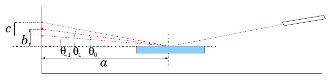

```{r setup, include=FALSE}
options(htmltools.dir.version=FALSE)
knitr::opts_chunk$set(fig.retina=3, fig.path="img/figure-html/")
```

# Quantity Calculus

.pull-left[
Two quotes from Cobb and Moore (1997):

> Data are not just numbers, they are numbers with a **context**.
> 
> In data analysis, context provides meaning.
]

--

.pull-right[
Examples of context in R:

- Names of `data.frame` columns
- Dimensions of an array
- Levels of `factor`
- Time-related objects `POSIXt`, `Date`, `difftime`...
]

--

.pull-left[
<br>

From the International Vocabulary of Metrology (VIM):

> [A **quantity** is] a property of a phenomenon, body, or substance, where the property has a magnitude that can be expressed as a number and a reference.
]

--

.pull-right[
<br>

$$\LARGE \overbrace{10.45}^{\text{value}} \overbrace{\underbrace{\pm \quad 0.03}_{\text{uncertainty}} \quad \underbrace{\text{km}}_{\text{unit}}}^{\text{context}}$$
]

---

# units

.footnote[
[1] Pebesma E, Mailund T, Hiebert J (2016). "Measurement Units in R." _R Journal_, 8(2), 486-494. doi: 10.32614/RJ-2016-061.
]

.pull-left[
The `units` package [1]: 

- Support for measurement units in R vectors and arrays
- Automatic propagation, conversion, simplification
- Raising errors in case of unit incompatibility
- Compatible with the POSIXct, Date and difftime classes
- Uses Unidata's `UDUNITS-2` library and database
]

--

.pull-right[
```{r, echo=FALSE}
set.seed(42)
```
```{r, error=TRUE, message=FALSE}
library(units)

x <- set_units(rnorm(3), m)
y <- set_units(rnorm(3), s)
sum(x)
x / y
x + y
```
]

--

.pull-left[
Specifics:

- S3 implementation
- Group Generics `Math`, `Ops`, `Summary` and more
- `?units_options` controls printing, parsing, autoconversion and simplification
- Installation of new units
]

---

# errors

.footnote[
[1] **Ucar I**, Pebesma E, Azcorra A (2018). "Measurement Errors in R." _R Journal_, 10(2), 549-557. doi: 10.32614/RJ-2018-075.
]

.pull-left[
The `errors` package [1]:

- Support for uncertainties in R vectors and arrays
- Automatic propagation (first-order TSM, as recommended by BIPM's GUM)
- Pretty printing (also following BIPM's GUM)
]

--

.pull-right[
```{r, echo=FALSE}
set.seed(42)
```
```{r, error=TRUE}
library(errors)

x <- set_errors(rnorm(3), 0.1)
y <- set_errors(rnorm(3), 0.1)
sum(x)
print(sum(x), notation="plus-minus", digits=2)
x / y
```
]

--

.pull-left[
Specifics:

- S3 implementation
- Correlations/covariances across objects
- Group Generics `Math`, `Ops`, `Summary` and more
- Options for printing control, by default
  - `errors.notation = "parenthesis"`
  - `errors.digits = 1`
]

---

# quantities

.footnote[
[1] R-Quantities organization on GitHub: https://github.com/r-quantities/
<br>[2] Announcement: https://www.r-consortium.org/announcement/2018/02/22/announcing-second-round-isc-funded-projects-2017
]

.pull-left[
The `quantities` framework [1]:

- Project funded by the R Consortium [2]
- Integrates `units` and `errors`
- Complete Quantity Calculus system for R
]

--

.pull-right[
```{r, echo=FALSE}
set.seed(42)
```
```{r, error=TRUE}
library(quantities)

x <- set_quantities(rnorm(3), m, 0.1)
y <- set_quantities(rnorm(3), s, 0.1)
sum(x)
x / y
x + y
```
]

--

.pull-left[
Specifics:

- S3 implementation as a super-class
- Again, Group Generics and other stuff
- Support all conversions, resolve conflicts
- Data wrangling guide (see vignette)
- Parsers (see vignette)
]

---

# Example: a physics experiment

.pull-left[

## Surface tension in liquids



- Dispersion relation for capillary waves

$$w^2 = \frac{\sigma}{\rho}|k|^3, \quad k = \frac{\pi}{n\lambda}\frac{c_n}{a}\sin\left(\frac{b}{a}\right)$$
```{r, echo=FALSE}
df <- data.frame(
   f = c(100, 110, 120, 130, 140, 150, 160, 170, 180, 190, 201, 210,
         220, 230, 240, 250, 260, 270, 277, 290, 299, 310, 320, 330,
         335, 340, 345, 352, 361, 368, 376, 383, 390, 403),
  d1 = c(11, 12, 13, 13, 14, 15, 16, 16, 17, 17, 18, 18, 19, 20, 20,
         21, 21, 22, 23, 23, 23, 24, 24, 24, 24, 25, 25, 25, 26, 26,
         27, 27, 27, 28),
  d2 = c(22, 24, 25, 27, 28, 29, 31, 32, 33, 34, 36, 37, 37, 39, 40,
         41, 42, 44, 45, 46, 46, 47, 48, 49, 50, 50, 51, 51, 52, 53,
         53, NA, NA, NA)
)
df <- tidyr::gather(df, n, c_n, d1, d2)[1:65,]
df$n <- as.integer(sub("d", "", df$n))
```
```{r}
str(df)
```
]

--

.pull-right[
```{r, warning=FALSE}
library(quantities)

a <- set_quantities(3095, mm, 10)
b <- set_quantities(414+116-203, mm, 1+1+3)
l <- set_quantities(633, nm, 0)

df <- within(df, {
  f <- set_quantities(f, Hz, 1)
  c_n <- set_quantities(c_n, mm, 1)
  
  w2 <- set_units(2 * pi * f, rad/s)^2             #<<
  k3 <- set_units(                                 #<<
    (pi/l/n) * (c_n/a) * sin(set_units(b/a, rad)), #<<
    rad/mm)^3                                      #<<
})
head(df[, c("w2", "k3")], 3)
```
]

---

# Example: a physics experiment

.pull-left[
```{r dispersion-relation-ref, eval=FALSE}
library(ggplot2)
library(ggforce)#<<

ggplot(df) + aes(k3, w2) +
  geom_errorbar(
    aes(ymin=errors_min(w2), ymax=errors_max(w2))) +#<<
  geom_errorbarh(
    aes(xmin=errors_min(k3), xmax=errors_max(k3))) +#<<
  geom_point() + geom_smooth(method="lm")
```
]

.pull-right[
```{r dispersion-relation, ref.label="dispersion-relation-ref", fig.callout=TRUE, echo=FALSE}
```
]

--

.pull-left[
.footnote[
[1] See https://www.r-spatial.org/r/2018/08/31/quantities-final.html#fitting-linear-models-with-quantities
]

Measure the surface tension:

```{r, echo=FALSE}
qlm <- function(formula, data, ...) {
  # get units info, then drop quantities
  row <- data[1,]
  for (var in colnames(data)) if (inherits(data[[var]], "quantities")) {
    data[[var]] <- drop_quantities(data[[var]])
  }

  # fit linear model and add units info for later use
  fit <- lm(formula, data, ...)
  fit$units <- lapply(eval(attr(fit$terms, "variables"), row), units)
  class(fit) <- c("qlm", class(fit))
  fit
}

coef.qlm <- function(object, ...) {
  # compute coefficients' units
  coef.units <- lapply(object$units, as_units)
  for (i in seq_len(length(coef.units)-1)+1)
    coef.units[[i]] <- coef.units[[1]]/coef.units[[i]]
  coef.units <- lapply(coef.units, units)

  # use units above and vcov diagonal to set quantities
  coef <- mapply(set_quantities, NextMethod(), coef.units,
                 sqrt(diag(vcov(object))), mode="symbolic", SIMPLIFY=FALSE)

  # use the rest of the vcov to set correlations
  p <- combn(names(coef), 2)
  for (i in seq_len(ncol(p)))
    covar(coef[[p[1, i]]], coef[[p[2, i]]]) <- vcov(fit)[p[1, i], p[2, i]]

  coef
}
```

```{r, eval=FALSE}
fit <- qlm(w2 ~ k3, df) # [1]
rho <- set_quantities(997, kg/m^3, 1)
sigma <- coef(fit)$k3 * rho
set_units(sigma, dyne/cm)
```

```
## 61.2(6) [dyne/cm]
```
]

---

# Summary

<br>

.font130[
- Transparent (almost) support for quantity calculus (i.e., computations with context) in R

  - Assign units and/uncertainty metadata and go
  - Automatic propagation, conversion, simplification and reporting
]

--

.font130[
- Published in the R Journal [1, 2], following BIPM's recommendations
]

.footnote[
[1] Pebesma E, Mailund T, Hiebert J (2016). "Measurement Units in R." _R Journal_, 8(2), 486-494. doi: 10.32614/RJ-2016-061.<br>
[2] **Ucar I**, Pebesma E, Azcorra A (2018). "Measurement Errors in R." _R Journal_, 10(2), 549-557. doi: 10.32614/RJ-2018-075.
]

--

.font130[
- `units` (reference) and `errors` (uncertainty) developed in separate packages

- Integrated within the `quantities` framework
]

---
class: center, middle, inverse, mline

# Thanks!

**https://github.com/r-quantities**

<br><br><br>

<div class="hexagon" style="bottom:0;left:7px"></div>
<div class="hexagon" style="bottom:0;left:143px"></div>
<div class="hexagon" style="bottom:0;left:279px"></div>
<div class="hexagon" style="bottom:0;left:415px"></div>
<div class="hexagon" style="bottom:0;left:551px"></div>

<div class="hexagon" style="bottom:118px;left:75px"></div>
<div style="position:absolute;bottom:150px;left:233px;width:85px;filter:drop-shadow(2px 4px 6px black)"></div>
<div class="hexagon" style="bottom:118px;left:347px"></div>

<div class="hexagon" style="bottom:236px;left:143px"></div>
